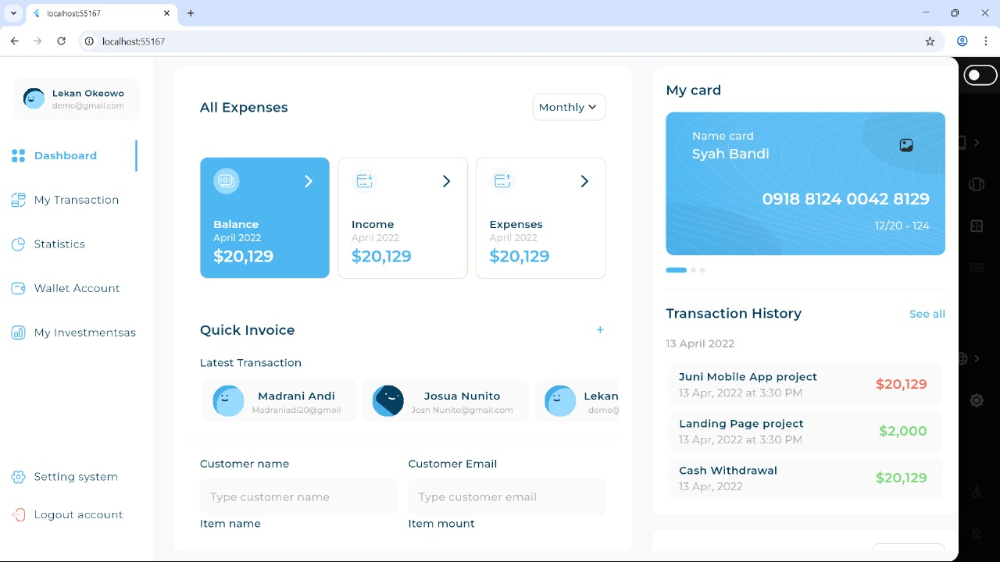
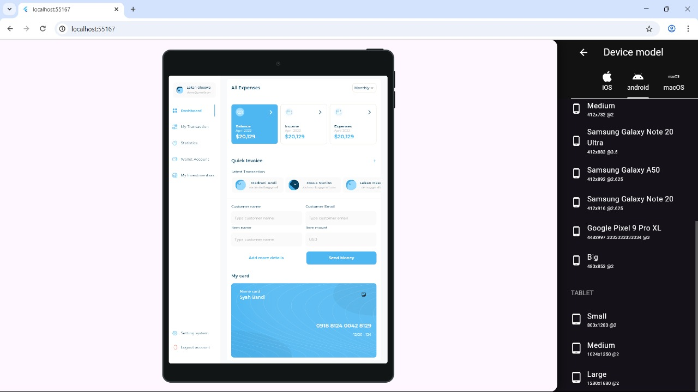
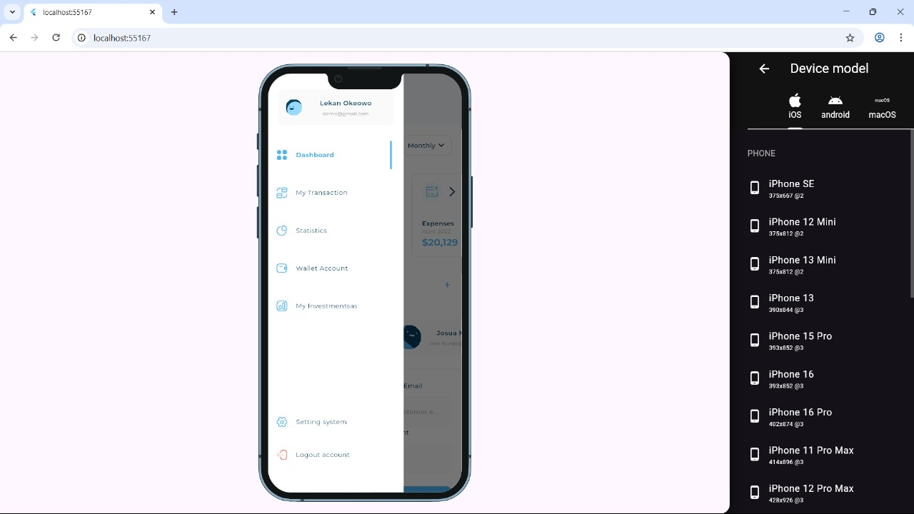
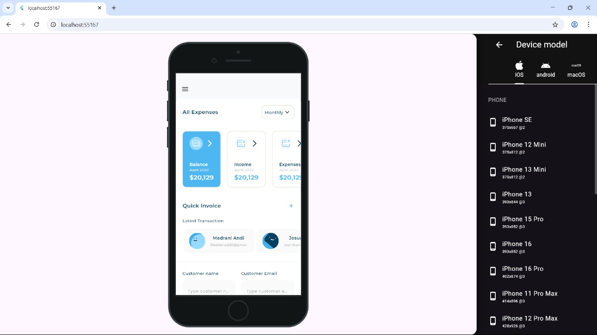

# 📊 Responsive Dashboard UI

A Flutter-based training project to practice building a clean, responsive, and scalable dashboard UI. The project focuses on layout design and adapting the interface for different screen sizes (mobile, tablet, desktop).

## 🎯 Objective

- Practice responsive design in Flutter
- Use `CustomScrollView`, `Sliver`, and `MediaQuery`
- Build UI components like sidebar, cards, pie chart, and forms
- Apply clean UI architecture with reusable widgets

## 📱 Preview

<p align="center">
  
  
</p>

<p align="center">
  
  
</p>

## 🛠 Technologies

- Flutter
- `fl_chart`
- `flutter_svg`
- `expandable_page_view`

## 🚀 How to Run

```bash
git clone https://github.com/your-username/flexible_dashboard_ui.git
cd flexible_dashboard_ui
flutter pub get
flutter run
